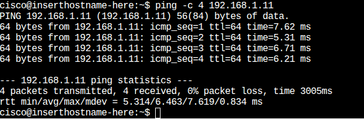
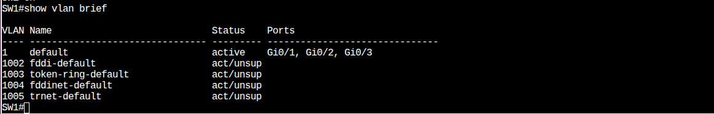
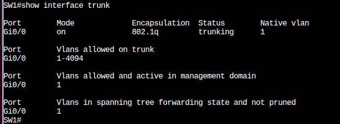
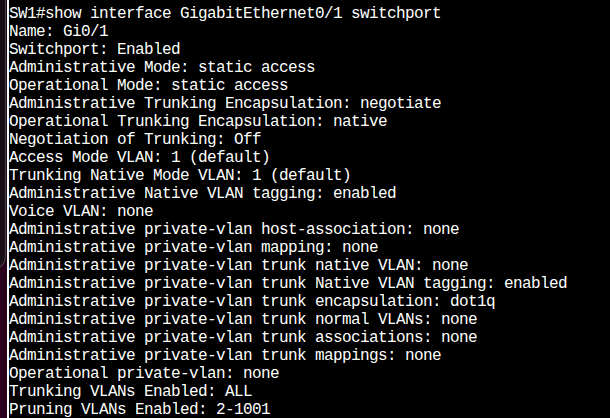
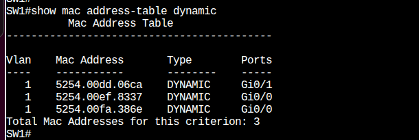

sudo ip addr add 192.168.1.10/24 dev ens2
sudo ip link set ens2 up
Markdown

Switch Configuration Commands (Example for SW1)
Full configurations can be found in the configs/ directory. Key excerpts:
! On SW1 - Interface to PC1
interface GigabitEthernet0/1
 description Link to PC1
 switchport mode access
 spanning-tree portfast edge
!
! On SW1 - Interface to SW2 (Trunk)
interface GigabitEthernet0/0
 description Link to SW2
 switchport trunk encapsulation dot1q
 switchport mode trunk
Cisco

Key Verification Commands
! On Switches
show vlan brief
show interfaces trunk
show mac address-table dynamic
show interfaces <interface-name> switchport
Cisco

! On Ubuntu PCs
ip addr show ens2
ping <ip_address_of_other_pc>
Bash

Expected Outputs and Verification
The primary goal is for PC1 to successfully ping PC2, and for the MAC address tables on the switches to correctly reflect learned MAC addresses.
1. Connectivity Test (Ping)
From PC1 to PC2:
ping 192.168.1.11
Bash

Expected Result: Successful replies.

2. Verifying VLANs on SW1
SW1# show vlan brief
Cisco

Note: Gi0/1 is in VLAN 1.
3. Verifying Trunk Link on SW1
SW1# show interfaces trunk
Cisco

Note: Gi0/0 is trunking with 802.1q encapsulation and Native VLAN 1.
4. Verifying Access Port on SW1
SW1# show interface GigabitEthernet0/1 switchport
Cisco

Note: Gi0/1 is operating as an access port in VLAN 1.
5. Verifying MAC Address Table on SW1 (Post-Ping)
SW1# show mac address-table dynamic
Cisco

Explanation:
The MAC address of PC1 (connected to Gi0/1) is learned on interface Gi0/1.
The MAC address of PC2 (behind SW2) is learned on interface Gi0/0 (the Trunk link).
The MAC address of SW2's interface might also be learned on Gi0/0.
This demonstrates that SW1 has correctly built its MAC table and knows how to reach the devices.
Project Files
topology.png: Network topology diagram.
my_first_cml_lab.yaml: CML Lab file (can be imported directly).
configs/: Directory containing switch configuration files:
SW1_config.txt
SW2_config.txt
screenshots/: Directory containing screenshots of important command outputs.
How to Use This Project
Clone this repository.
In CML, import the my_first_cml_lab.yaml file to create the lab.
Start the devices.
Apply configurations from the configs/ files or type them manually.
Configure IP addresses on the Ubuntu PCs.
Perform ping tests and verify command outputs as described.

