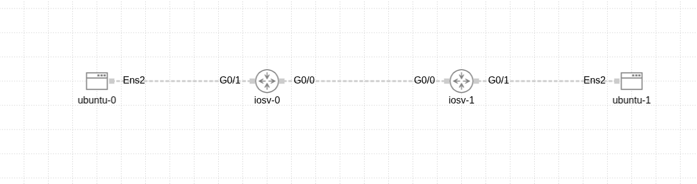

Copy all the text below and paste it into your nano editor (after clearing any existing content if you had the Arabic version there):
# CML Static Routing Lab: Router-to-Router

This project demonstrates a basic static routing configuration between two Cisco IOSv routers in a Cisco CML environment. It includes connectivity between two Ubuntu end-devices across different networks. The CML lab export file (`.yaml`) is provided for easy recreation.

## Network Topology

*(Note: This image will be displayed once uploaded to GitHub)*

## Project Goal
- To understand how routers forward data between different networks.
- To implement IP addressing on end-devices (Ubuntu) and router interfaces.
- To manually configure static routes.
- To test connectivity and verify routing tables.

## Project Files
- **CML Lab Export File:** [Lab_at_Thu_15_15_PM.yaml](Lab_at_Thu_15_15_PM.yaml)
  (This file can be imported directly into Cisco CML to recreate the lab topology and basic device setup.)
- **Successful Ping Screenshot:** [final-ping-success.png](final-ping-success.png)
  (Proof of end-to-end connectivity.)
- **Router Configuration Files:**
  - [R1 Configuration](configs/R1-config.txt)
  - [R2 Configuration](configs/R2-config.txt)

## IP Addressing Plan

| Device / Interface      | IP Address          | Subnet Mask       | Default Gateway (for Ubuntu) | Notes in Config    |
|-------------------------|---------------------|-------------------|------------------------------|--------------------|
| `ubuntu-0` (ens2)       | `192.168.1.10`      | `255.255.255.0`   | `192.168.1.1`                | PC1                |
| `R1 (iosv-0)` (Gi0/1)   | `192.168.1.1`       | `255.255.255.0`   | -                            | link to PC1        |
| `R1 (iosv-0)` (Gi0/0)   | `10.0.0.1`          | `255.255.255.252` | -                            | link to R2         |
| `R2 (iosv-1)` (Gi0/0)   | `10.0.0.2`          | `255.255.255.252` | -                            | link to R1         |
| `R2 (iosv-1)` (Gi0/1)   | `192.168.2.1`       | `255.255.255.0`   | -                            | link to PC2        |
| `ubuntu-1` (ens2)       | `192.168.2.10`      | `255.255.255.0`   | `192.168.2.1`                | PC2                |

## Key Configuration Snippets
(For full configurations, please refer to the `.txt` files in the `configs` folder.)

### Ubuntu-0 (PC1) Configuration
```bash
sudo ip addr add 192.168.1.10/24 dev ens2
sudo ip route add default via 192.168.1.1


R1 (iosv-0) Configuration
hostname R1
!
interface GigabitEthernet0/1
 description link to PC1
 ip address 192.168.1.1 255.255.255.0
 no shutdown
!
interface GigabitEthernet0/0
 description link to R2
 ip address 10.0.0.1 255.255.255.252
 no shutdown
!
ip route 192.168.2.0 255.255.255.0 10.0.0.2


R2 (iosv-1) Configuration
hostname R2
!
interface GigabitEthernet0/0
 description link to R1
 ip address 10.0.0.2 255.255.255.252
 no shutdown
!
interface GigabitEthernet0/1
 description link to PC2
 ip address 192.168.2.1 255.255.255.0
 no shutdown
!
ip route 192.168.1.0 255.255.255.0 10.0.0.1


Ubuntu-1 (PC2) Configuration
sudo ip addr add 192.168.2.10/24 dev ens2
sudo ip route add default via 192.168.2.1
Bash

Verification Commands
From ubuntu-0: ping 192.168.2.10
From ubuntu-1: ping 192.168.1.10
(Optional) From ubuntu-0: traceroute 192.168.2.10
On routers (R1 & R2): show ip route and show ip interface brief
---

**How to save and exit `nano` (Recap):**

1.  After pasting the text into `nano`.
2.  Press `Ctrl+X` (to Exit).
3.  `nano` will ask: `Save modified buffer?`. Type `Y` (for Yes).
4.  It will then ask for the `File Name to Write: README.md`. Press `Enter` to confirm.

Now you will have an English `README.md` file saved in your `Network.Router to Router` folder on your Desktop.

---

**Next Steps (after you've created this `README.md` file):**

1.  **Create a new repository on GitHub.**
2.  **Upload all your project files to this new repository:**
    *   `README.md` (the English version you just created)
    *   `network-topology.png`
    *   `final-ping-success.png`
    *   `Lab_at_Thu_15_15_PM.yaml`
    *   The `configs` folder (containing `R1-config.txt` and `R2-config.txt`)

Are these steps clear? Give it a try with creating the English `README.md` using `nano`. Let me know if you encounter any issues!


