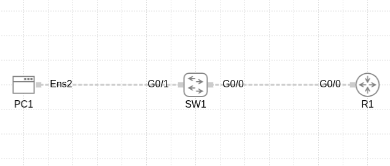
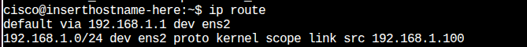
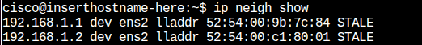
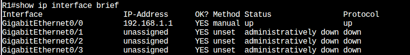
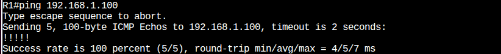
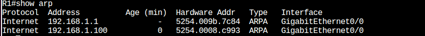
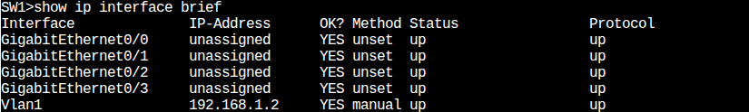
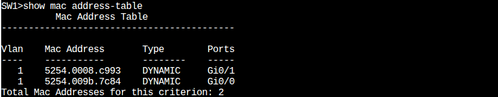

# Project: Basic Router, Switch, and PC (Ubuntu) Connectivity

## 1. Main Idea of the Project
To build the simplest practical Local Area Network (LAN) consisting of a PC, a switch, and a router. The goal is to understand how these fundamental components interact to achieve connectivity. This project serves as a cornerstone for understanding basic networking concepts.

## 2. Learning Objectives
This project aims to achieve a comprehensive understanding of the following:
*   **Device Roles:**
    *   The role of the PC (PC1) as an end-device on the network.
    *   The role of the Switch (SW1) as a Layer 2 device that connects devices and makes forwarding decisions based on MAC addresses.
    *   The role of the Router (R1) as a Layer 3 device that acts as the default gateway for the local network.
*   **Addressing:**
    *   How to assign static IP addresses, subnet masks, and default gateways to device interfaces (router, switch, PC).
*   **Basic Communication Protocols:**
    *   Using the ICMP protocol (`ping` command) to verify connectivity.
    *   Understanding the mechanism of ARP (Address Resolution Protocol) and Neighbor Discovery, and how they map IP addresses to MAC addresses.
*   **Switch Operation:**
    *   Understanding how a switch builds its MAC Address Table and uses it to forward frames.
*   **Verification Commands:**
    *   Becoming familiar with basic CLI commands for verifying configurations and connectivity on Cisco IOS and Linux devices.

## 3. Requirements
*   **Simulation Software:** Cisco Modeling Labs (CML)
*   **Virtual Devices:**
    *   One Router (R1) - (e.g., Cisco IOSv)
    *   One Switch (SW1) - (e.g., Cisco IOSvL2)
    *   One PC (PC1) - (Ubuntu Linux VM)

## 4. Network Topology


[PC1 (ens2)] ---- [SW1 (G0/1)] ---- [SW1 (G0/0)] ---- [R1 (G0/0)]
*   **Topology Diagram:**
    
    *(Ensure you have an image named `topology.png` in the same folder)*

## 5. IP Addressing Table
| Device    | Interface / Port              | IP Address      | Subnet Mask         | Default Gateway   | Notes                                     |
| :-------- | :---------------------------- | :-------------- | :------------------ | :---------------- | :---------------------------------------- |
| R1        | `GigabitEthernet0/0` (G0/0)   | `192.168.1.1`   | `255.255.255.0` (/24)| -                 | Connected to SW1 on port G0/0             |
| SW1       | `Vlan1` (Management)          | `192.168.1.2`   | `255.255.255.0` (/24)| `192.168.1.1`     | For switch management                     |
| PC1       | `ens2`                        | `192.168.1.100` | `255.255.255.0` (/24)| `192.168.1.1`     | Ubuntu OS                                 |

---

## 6. Step-by-Step Configuration

### a. Router Configuration (R1)
```text
enable
configure terminal

hostname R1

interface GigabitEthernet0/0
 ip address 192.168.1.1 255.255.255.0
 description Link to SW1
 no shutdown
 exit

end
write memory

b. Switch Configuration (SW1)
enable
configure terminal

hostname SW1

interface Vlan1
 ip address 192.168.1.2 255.255.255.0
 description Management Interface
 no shutdown
 exit

ip default-gateway 192.168.1.1

end
write memory

c. PC Configuration (PC1 - Ubuntu) - Temporary commands for testing
# (Execute these commands in PC1's Terminal)
sudo ip addr add 192.168.1.100/24 dev ens2
sudo ip link set ens2 up
sudo ip route add default via 192.168.1.1


(Note: To make settings persistent on Ubuntu, it's recommended to use netplan as previously discussed. The commands above are temporary and lost on reboot).
7. Verification Commands and Expected Results
a. From PC1 (Ubuntu)
Verify IP Settings:
ip addr show ens2


Expected Result: Should show inet 192.168.1.100/24 for the ens2 interface.

Verify Default Gateway:
ip route


Expected Result: Should show a line default via 192.168.1.1 dev ens2.

Test Connectivity to Gateway (R1):
ping -c 4 192.168.1.1


Expected Result: 4 successful replies from 192.168.1.1 with 0% packet loss.

Test Connectivity to Switch (SW1 - Management Interface):
ping -c 4 192.168.1.2


Expected Result: 4 successful replies from 192.168.1.2 with 0% packet loss.

Display Neighbor (ARP) Table:
ip neigh show


Expected Result: After successful pings, entries for 192.168.1.1 (R1's interface MAC) and 192.168.1.2 (SW1's interface MAC) should appear, along with their MAC addresses.

b. From Router (R1)
Verify Interface Status and IP Addresses:
show ip interface brief


Expected Result: Interface GigabitEthernet0/0 should be up in Status and Protocol with IP address 192.168.1.1.

Test Connectivity to PC1:
ping 192.168.1.100


Expected Result: A series of !!!!! (5 successes).

Display ARP Table:
show arp


Expected Result: An entry for 192.168.1.100 (PC1's MAC) should appear. (If this command does not show output on your IOSv image, this step can be considered optional as ARP is implicitly verified by successful pings).
(If you have a screenshot for show arp and it works, use: )
c. From Switch (SW1)
Verify Management Interface Status and IP Address:
show ip interface brief


Expected Result: Interface Vlan1 should be up in Status and Protocol with IP address 192.168.1.2.

Display MAC Address Table:
show mac address-table


Expected Result: At least two entries: PC1's MAC address associated with port GigabitEthernet0/1 (or the port connected to PC1), and R1's interface MAC address associated with port GigabitEthernet0/0 (or the port connected to R1).

8. Explanation of Key Concepts Applied
IP Addresses: Logical, unique identifiers for devices on a network, used to specify the source and destination of data. We assigned IPs from the 192.168.1.0/24 network.
Subnet Mask: Defines the network portion and host portion of an IP address. We used 255.255.255.0 (or /24), meaning the first 3 octets are for the network address and the last for the host.
Default Gateway: The IP address of a router that devices use to send data to networks other than their local one. In our case, PC1 and SW1 use R1 (192.168.1.1) as their gateway.
ARP (Address Resolution Protocol) / Neighbor Discovery: Used to map a Layer 3 IP address to a Layer 2 MAC address within the same local network. When a device wants to send data to another device on the same network and only knows its IP, it uses ARP (or Neighbor Discovery for IPv6, though we used IPv4 here) to discover the corresponding MAC address.
MAC Addresses: Unique physical identifiers for Network Interface Cards (NICs), hard-coded by the manufacturer. Switches use MAC addresses to forward frames within a local network.
MAC Address Table: Maintained by a switch to learn the MAC addresses of devices connected to each of its ports. This allows the switch to efficiently forward frames to the correct destination instead of flooding them to all ports every time.
ICMP (Internet Control Message Protocol): Used for network diagnostics and control. The ping command is its most common use, sending Echo Request messages and waiting for Echo Replies to verify connectivity.
Switching: The process by which a switch forwards frames between its ports based on destination MAC addresses found in its MAC address table.
Routing: The process by which a router forwards packets between different networks based on destination IP addresses and its routing table. (In this lab, the router's role as a gateway is a simple demonstration of routing).
9. Results and Conclusion
A simple local area network consisting of a router, switch, and PC was successfully built. All devices were configured with correct IP addresses, and full connectivity was achieved between them. The mechanisms of ARP/Neighbor Discovery and ICMP, as well as the role of the switch's MAC address table, were reviewed and understood. This project provides a strong foundation for understanding basic network interactions.
10. (Optional) Suggested Future Enhancements
Add a second PC to the network and understand how they communicate.
Configure a DHCP server on R1 to automatically assign IP addresses to devices.
Segment devices into different VLANs on the switch and set up inter-VLAN routing (Router-on-a-Stick).
Add a second router, create another network, and then configure static or dynamic routing between the two networks.


